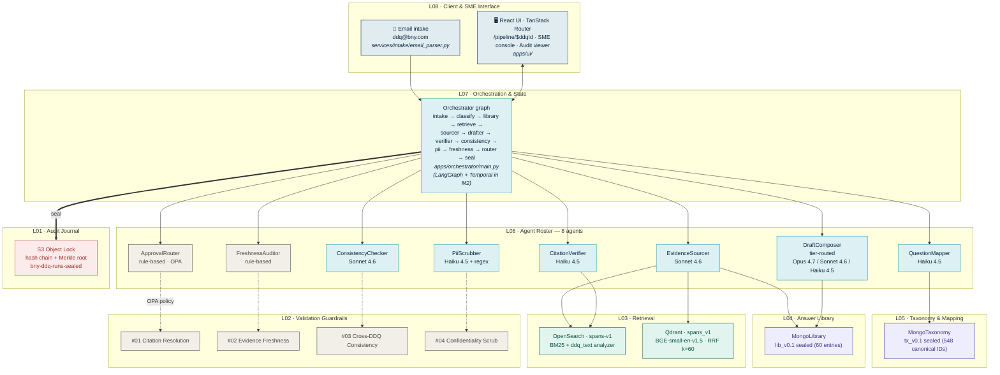
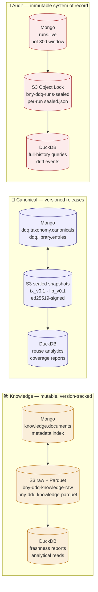
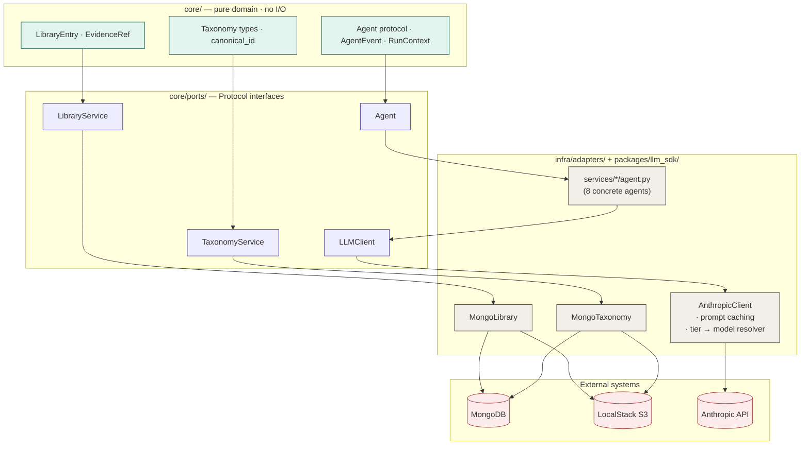

# BNY Agentic DDQ Response Platform — `ddq-platform`

Auto-responds to industry-standard due-diligence questionnaires (AFME, SIG, CAIQ, ADV, bespoke). The durable asset is the answer **library**, not the agent.

- Build contract: [`docs/ddq.md`](docs/ddq.md) (737-line spec)
- Bootstrap plan: [`docs/DATA-PLAN.md`](docs/DATA-PLAN.md) (2-week ramp before L01–L08 land)

## Status

| Phase | Source | Status |
|---|---|---|
| Day 1–2 — Vendor public frameworks (AFME, NIST, CSA) | DATA-PLAN §8 | ✅ done |
| Day 3–4 — EDGAR + BNY IR ingest into LocalStack S3 | DATA-PLAN §8 | ✅ done (126 objects, ~143 MB) |
| Day 5 — Parse corpus to evidence spans | DATA-PLAN §8 | ✅ done (13,466 spans, hash-stable) |
| Day 6 — Lexical index (OpenSearch BM25) | DATA-PLAN §8 | ✅ done (`spans-v1`, 6/7 smoke PASS) |
| Day 7 — Dense index + hybrid retrieval (RRF) | DATA-PLAN §8 | ✅ done (Qdrant, BGE-small-en-v1.5, 7/7 PASS) |
| Day 8 — Taxonomy v0.1 cut | DATA-PLAN §8 | ✅ done (548 canonical IDs, signed) |
| Day 9 — Library v0 (~50 entries) | DATA-PLAN §8 | ✅ done (60 entries, signed) |
| Day 10 — Eval set v0 + harness | DATA-PLAN §8 | ✅ done (100 items, thresholds locked) |
| Day 13–14 — Wire it up end-to-end | DATA-PLAN §8 | ✅ done (L07 graph, Merkle-rooted runs) |
| **M1 Day 1** — 8-agent L06 roster + L08 email intake + pipeline UI | ddq.md §L06/L07/L08 | ✅ done |

## What's running today

End-to-end DDQ pipeline against live local backends:

```bash
.venv/bin/python -m apps.orchestrator.main \
  --eml data/fixtures/inbox/sample_ddq_2026q2.eml
```

For each of the 5 questions in the sample inbox, this:

1. Parses the `.eml` + CSV attachment into normalized questions
2. Runs the L07 graph through the 8 L06 agents against the live taxonomy / library / OpenSearch / Qdrant / LocalStack S3
3. Hash-chains every agent event into an L01-shaped journal with a Merkle root
4. Seals each sealed run to `s3://bny-ddq-runs-sealed/<run_id>/sealed.json` plus an aggregated DDQ packet under `inbox/<ddq_id>/sealed_packet.json`
5. Emits a UI fixture (`apps/ui/src/mocks/fixtures/pipelines/<ddq_id>.json`) consumed by the `/pipeline/$ddqId` route in `apps/ui` — top half shows the email + 12-stage strip, bottom half is a data inspector showing the actual input/output payload at each stage

---

## Architecture

The platform is organized as eight layers (`ddq.md §L01–L08`) over a three-domain data spine (Knowledge / Canonical / Audit). Every external system is reached through a port in `core/ports/`; concrete drivers live in `infra/adapters/`.

### 1 · Layer view



### 2 · Per-question pipeline (the L07 graph)

Twelve stages run for every incoming question. Status colors in the UI map 1:1 to this DAG: ✓ pass, ⚠ warn, ✗ halt, – skip.

```mermaid
flowchart LR
    classDef sys   fill:#E1ECF1,stroke:#04243C
    classDef agent fill:#DDF1F4,stroke:#2B9CAE
    classDef rule  fill:#F1EFE8,stroke:#444441
    classDef store fill:#EEEDFE,stroke:#3C3489
    classDef seal  fill:#FCEBEB,stroke:#A32D2D

    E[📧 .eml<br/>CSV / JSON attachments]:::sys
    I([1 · intake<br/>parse, hash, mint run_id]):::sys
    M([2 · QuestionMapper<br/>Haiku → canonical_id + conf]):::agent
    L{{3 · library_lookup<br/>by canonical_id+entity}}:::store
    R([4 · retrieve<br/>BM25 + dense + RRF k=60]):::sys
    S([5 · EvidenceSourcer<br/>Sonnet curates bundle]):::agent
    D([6 · DraftComposer<br/>tier-routed Opus / Sonnet]):::agent
    V([7 · CitationVerifier<br/>Haiku — claim ↔ span check]):::agent
    K([8 · ConsistencyChecker<br/>Sonnet vs prior shipped]):::agent
    P([9 · PiiScrubber<br/>regex + Haiku contextual]):::agent
    F([10 · FreshnessAuditor<br/>rule-based · expiry/staleness]):::rule
    A([11 · ApprovalRouter<br/>OPA stand-in · queue + tier]):::rule
    Z[(12 · seal · L01<br/>chain + Merkle → S3 Object Lock)]:::seal

    E --> I --> M --> L
    L -- hit --> D
    L -- miss --> R --> S --> D
    D --> V --> K --> P --> F --> A --> Z

    Z -. auto_approve .-> OUT1[📤 Outbound packet]
    Z -. sme_queue .-> OUT2[👤 SME queue<br/>infosec / cyber / esg / regulatory / ops]
    Z -. halt .-> OUT3[⚖ Legal review]

    classDef out fill:#FAEEDA,stroke:#BA7517
    class OUT1,OUT2,OUT3 out
```



**Per-stage breakdown (proven by token counts in the sealed journal):**

| # | Stage | Owner | LLM call | Tier / model | Tools |
|---|---|---|---|---|---|
| 1 | intake | Orchestrator | — | — | email_parser → `IngestedDDQ` |
| 2 | QuestionMapper | L06 agent | ✅ | Haiku 4.5 | Taxonomy.classify, candidate shortlist |
| 3 | library_lookup | Orchestrator | — | — | Mongo `ddq.library.entries` |
| 4 | retrieve | Orchestrator | — | — | OpenSearch BM25 + Qdrant dense + RRF |
| 5 | EvidenceSourcer | L06 agent | ✅ | Sonnet 4.6 | curates bundle (never drafts) |
| 6 | DraftComposer | L06 agent | ✅ | Opus 4.7 / Sonnet 4.6 / Haiku 4.5 | `[span:…]` inline citations |
| 7 | CitationVerifier | L06 agent | ✅ | Haiku 4.5 | span_hash resolve + semantic support |
| 8 | ConsistencyChecker | L06 agent | conditional | Sonnet 4.6 | DuckDB response_register; skipped when no prior |
| 9 | PiiScrubber | L06 agent | ✅ | Haiku 4.5 + regex | Presidio (M1+), SSN/account regex pre-pass |
| 10 | FreshnessAuditor | L06 rule | — | — | library.expiry, evidence age policy |
| 11 | ApprovalRouter | L06 rule | — | — | OPA → SME queue + tier |
| 12 | seal | Orchestrator | — | — | hash-chain events, Merkle root, Object Lock |

### 3 · Data spine — three domains, three engines



**Local dev runtime:** LocalStack at `:4566` with five buckets — `bny-ddq-knowledge-raw`, `bny-ddq-knowledge-parquet` (mutable), `bny-ddq-library-sealed`, `bny-ddq-taxonomy-snapshots`, `bny-ddq-runs-sealed` (Object Lock). Mongo / Redis / OpenSearch / Qdrant / Neo4j run via `infra/docker/docker-compose.yml`.

### 4 · Repository pattern — ports & adapters

Every external system reaches the domain through a port; concrete adapters can be swapped (e.g. Anthropic ↔ Bedrock; Mongo ↔ Postgres for tests).



### 5 · Audit chain — hash-linked event journal

Every run produces a deterministic, hash-chained, Merkle-rooted journal that is replayable from `s3://bny-ddq-runs-sealed/<run_id>/sealed.json`.

```mermaid
flowchart LR
    classDef ev fill:#DDF1F4,stroke:#2B9CAE
    classDef sealed fill:#FCEBEB,stroke:#A32D2D

    E1[evt_1<br/>intake<br/>payload_hash=h1]:::ev
    E2[evt_2<br/>QuestionMapper.invoke<br/>payload_hash=h2]:::ev
    E3[evt_3<br/>QuestionMapper.result<br/>payload_hash=h3]:::ev
    EN[…]:::ev
    E17[evt_17<br/>ApprovalRouter.result<br/>payload_hash=h17]:::ev

    E1 -->|chain_hash=H1<br/>= sha256(0..0 ‖ id1 ‖ h1)| E2
    E2 -->|chain_hash=H2<br/>= sha256(H1 ‖ id2 ‖ h2)| E3
    E3 --> EN --> E17

    E17 ==>|merkle_root over h1..h17| SEAL[(Sealed JSON<br/>Object Lock retention)]:::sealed

    SEAL --> R[Replay verifier<br/>recompute root + chain]:::ev
```

---

## Quick start

```bash
# 0. one-time: venv (boto3 + anthropic + python-dotenv + sentence-transformers etc.)
python3 -m venv .venv && .venv/bin/pip install -q -r requirements-bootstrap.txt

# 1. bring up local backends (LocalStack, Mongo, OpenSearch, Qdrant)
docker compose -f infra/docker/docker-compose.yml up -d \
    localstack mongo opensearch qdrant

# 2. Day 1–10: bootstrap the corpus / indexes / taxonomy / library
.venv/bin/python data/bootstrap/fetch_sources.py
.venv/bin/python data/bootstrap/verify_sources.py
.venv/bin/python data/bootstrap/01_fetch_edgar.py
.venv/bin/python data/bootstrap/02_fetch_bny_ir.py
.venv/bin/python data/bootstrap/03_parse_corpus.py
.venv/bin/python data/bootstrap/04_verify_spans.py
.venv/bin/python data/bootstrap/05_index_opensearch.py
PYTORCH_MPS_HIGH_WATERMARK_RATIO=0.0 \
    .venv/bin/python data/bootstrap/07_index_qdrant.py
.venv/bin/python data/bootstrap/09_build_taxonomy.py
.venv/bin/python data/bootstrap/10_seed_library.py

# 3. M1 Day 1: run the live 8-agent pipeline on a sample inbound email
#    (requires ANTROPIC_KEY / ANTHROPIC_KEY in .env — not committed)
.venv/bin/python data/fixtures/inbox/build_sample_eml.py
.venv/bin/python -m apps.orchestrator.main \
    --eml data/fixtures/inbox/sample_ddq_2026q2.eml

# 4. Build the UI fixture from the just-sealed runs and start the dev UI
.venv/bin/python data/bootstrap/13_build_pipeline_fixtures.py
cd apps/ui && npx vite --port 5174
# → open http://localhost:5174/pipeline/ddq_8db64d9cb6c5
```

---

## Repo layout

Per `docs/ddq.md` §3:

```
core/
  domain/          pure domain types (taxonomy, library, …)
  ports/           Protocol interfaces (TaxonomyService, LibraryService, Agent, LLMClient)
infra/
  adapters/        Mongo / S3 / Anthropic implementations of the ports
  docker/          docker-compose for local Mongo / Redis / OpenSearch / Qdrant / LocalStack
packages/
  llm_sdk/         LLMClient port + AnthropicClient adapter (Opus 4.7 / Sonnet 4.6 / Haiku 4.5)
  schemas/         Pydantic I/O models for the 8 agents
  audit_sdk/       (M2) signed event journal helpers
services/
  intake/          .eml + CSV/JSON parser → IngestedDDQ
  classifier/      QuestionMapper        (Haiku)        + prompts/v1.0.0.md
  retrieval/       EvidenceSourcer       (Sonnet)       + prompts/v1.0.0.md
  drafter/         DraftComposer         (tier-routed)  + prompts/v1.0.0.md
  validator/       CitationVerifier      (Haiku)        + prompts/v1.0.0.md
  consistency/     ConsistencyChecker    (Sonnet)       + prompts/v1.0.0.md
  pii/             PiiScrubber           (Haiku+regex)  + prompts/v1.0.0.md
  freshness/       FreshnessAuditor      (rule-based)
  router/          ApprovalRouter        (rule-based / OPA)
apps/
  orchestrator/    end-to-end pipeline runner (LangGraph + Temporal in M2)
  ui/              React + TanStack Router + Tailwind; /pipeline/$ddqId view
data/
  bootstrap/       Day 1–14 scripts (01..13)
  manifests/       per-run sealed JSON + per-DDQ inbox packets
  fixtures/inbox/  sample .eml for the live demo
evals/             eval set v0 (100 items) + thresholds + harness
docs/
  ddq.md           build contract (the spec; 737 lines)
  DATA-PLAN.md     bootstrap plan
  decisions/       ADRs
  runbooks/
```

---

## Stack of record

Per `ddq.md §2`: Mongo Atlas, S3 Object Lock, DuckDB, LangGraph + Temporal, OpenSearch, Qdrant, Cohere Rerank (M3), Neo4j (M2), Unstructured.io → format-specific parsers (ADR 0001), AWS Bedrock + Anthropic, Claude Opus/Sonnet/Haiku tier-routed, Redis, OPA, Presidio, Langfuse, FastAPI + React, Okta, Terraform + Helm, Python 3.12 + TS + Rego.

## Python version

`docs/ddq.md §2` specifies Python 3.12. The bootstrap scripts and orchestrator run on 3.9+ today; 3.12 is enforced in `pyproject.toml` once we add real dependency pinning (M1+).
